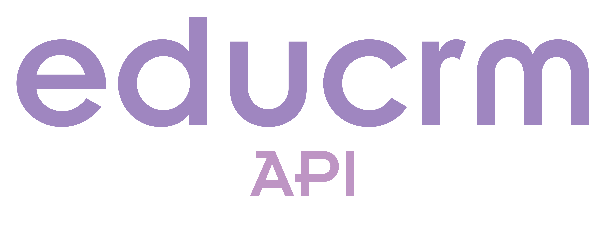

<div style="text-align: center"></div>

# EduCRM-API
> Overview of the EduCRM-API Objects, calls and interactions 

## Student Object
The student field is only for students, there are other objects for interacting with staff or schedules.
Here is the student objects
```json
{
    "uuid": "auto generated string",
    "student_id": 54495412315,
    "student_first_name": "First Name",
    "student_middle_name": "Middle Name",
    "student_last_name": "Last Name",
    "student_dob": "YYYY-MM-DD",
    "student_email": "email",
    "student_phone": "+27 96 521 3514",
    "student_gender": "gender"
}
```

### Create Student

Create a student with a post request.

Method: **Post**

Endpoint: **/student/create**

Payload:
```
- student_id (Required)
- student_first_name (Required)
- student_middle_name (Optional)
- student_last_name (Required)
- student_dob (Required)
- student_email (Required)
- student_phone (Required)
- student_gender (Optional)

```


